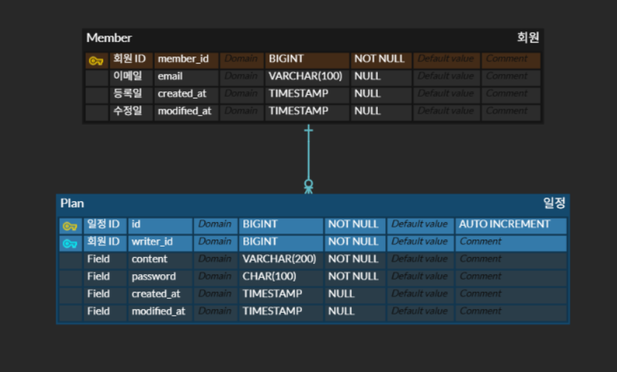

## API 명세서

### 1. 일정 생성
#### Method & URL
> POST {{BASE_URL}}/api/v1/plans
#### request

`RequestBody`
```json
{
    "task" : "할일1",
    "writer" : "현준",
    "password" : "asdf1234"
}
```
#### response
> 201
```json
{
    "id" : 42,
    "task" : "할일1",
    "writer" : "현준",
    "createdAt": "2025-05-22T15:30:12Z",
    "modifiedAt": "2025-05-22T15:30:12Z"
}
```

### 2. 일정 목록 조회
#### Method & URL
> GET {{BASE_URL}}/api/v1/plans

#### request
`RequestParam(query string)`

| Name         | Type   | Description |
|--------------|--------|-------------|
| modifiedDate | string | 수정된 날짜      |
| writer       | string | 작성자         |

#### response
> 200
```json
[
  {
    "id": 70,
    "content": "할일2",
    "writer": "준호",
    "createdAt": "2025-05-21T11:00:10Z",
    "modifiedAt": "2025-05-21T11:20:55Z"
  },
  {
    "id": 42,
    "content": "할일",
    "writer": "민준",
    "createdAt": "2025-05-22T15:30:12Z",
    "modifiedAt": "2025-05-22T15:30:12Z"
  }
]
```
### 3. 일정 조회
#### Method & URL
> GET {{BASE_URL}}/api/v1/plans/{id}
#### request
`PathVariable`

| Name | Type | Description |
|------|------|-------------|
| id   | long | 일정 ID      |
#### response
> 200
```json
{
    "id": 42,
    "content": "API 명세서 작성",
    "writer": "준호",
    "createdAt": "2025-05-22T15:30:12Z",
    "modifiedAt": "2025-05-22T15:30:12Z"
}
```
### 4. 일정 수정
#### Method & URL
> PUT {{BASE_URL}}/api/v1/plans/{id}
#### request
`PathVariable`

| Name | Type | Description |
|------|------|-------------|
| id   | long | 일정 ID      |
`RequestBody`
```json
{
    "task" : "할일1",
    "writer" : "현준",
    "password" : "asdf1234"
}
```
#### response
> 200
```json
{
    "id" : 42,
    "task" : "할일1",
    "writer" : "현준",
    "createdAt": "2025-05-22T15:30:12Z",
    "modifiedAt": "2025-05-22T15:30:12Z"
}
```
### 5. 일정 삭제
#### Method & URL
> DELETE {{BASE_URL}}/api/v1/plans/{id}
#### request
`PathVariable`

| Name | Type | Description |
|------|------|-------------|
| id   | long | 일정 ID      |

`RequestBody`
```json
{
    "password" : "asdf1234"
}
```
#### response
> 200
```json
{
    "message": "삭제되었습니다."
}
```

## DB 스키마



